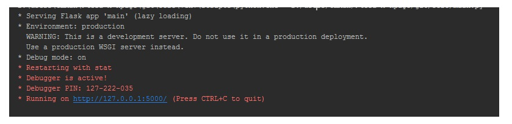
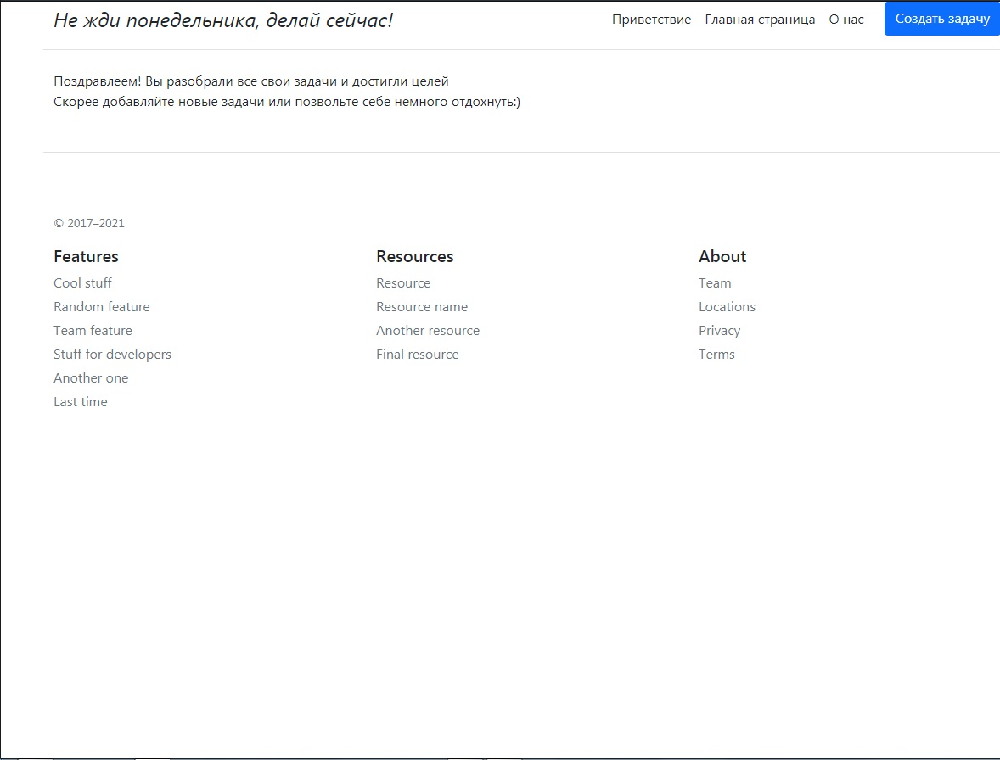
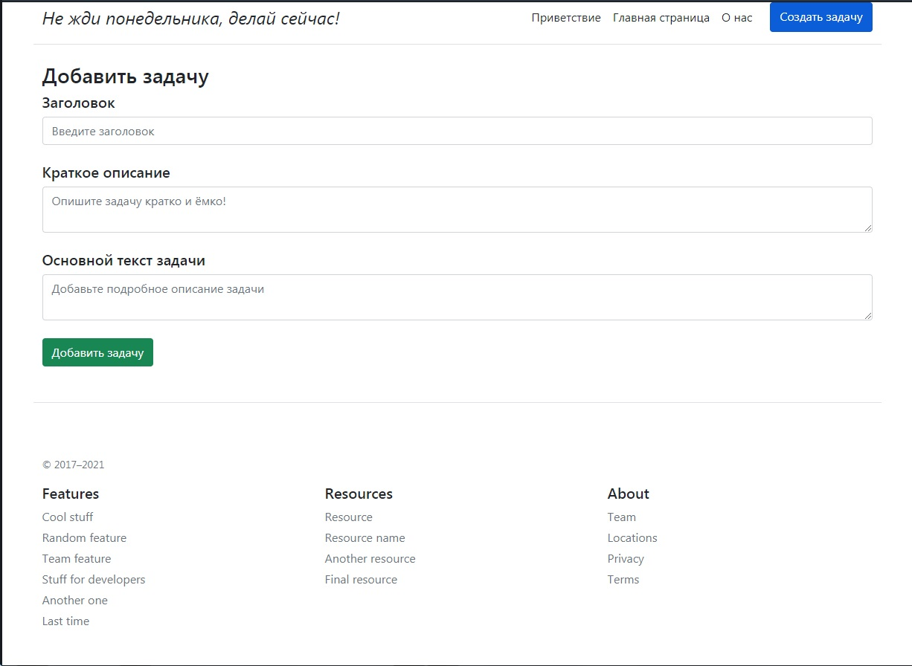
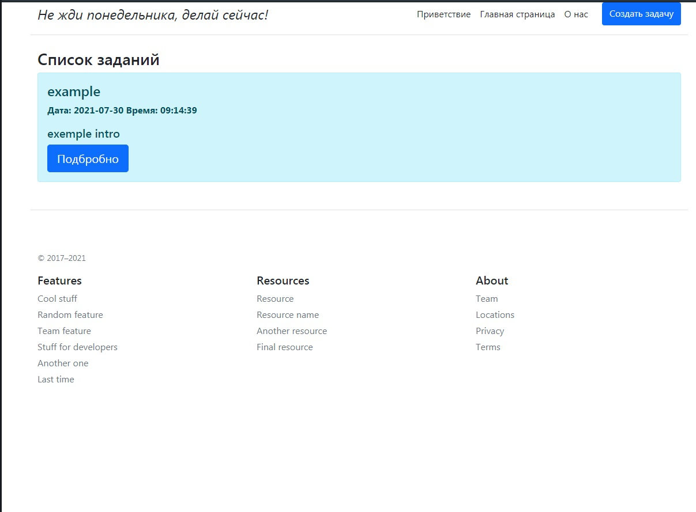
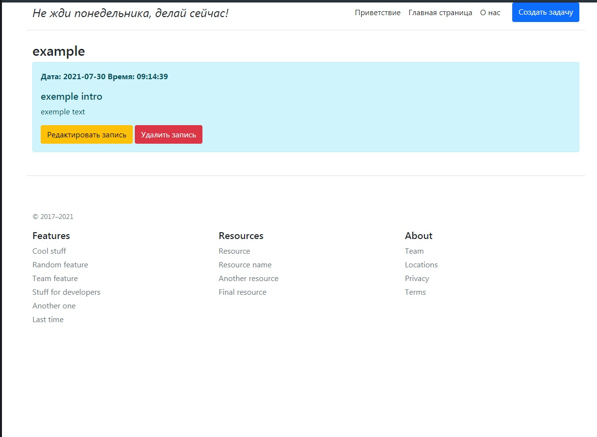

# ToDo

### Short dicription

Simple web app made with flask to learn this framework. To run this web app on your computer, you mast have Python 3.
This app made with Python 3.8.9. All used package you can install whith pip. 
All requirements was written to requirements.txt. 

### Getting Started 

To starting this web app, you need to download this github project on your computer. Ofcourse Python 3 must be installed
in your operation system. If you don`t have Python, go and install [Python!](https://www.python.org)

To install all package what you need to start this app, use your terminal:

    pip install -r requirements.txt

This is the list of requirements.txt:

* click==8.0.1
* colorama==0.4.4
* Flask==2.0.1
* Flask-SQLAlchemy==2.5.1
* greenlet==1.1.0
* itsdangerous==2.0.1
* Jinja2==3.0.1
* MarkupSafe==2.0.1
* SQLAlchemy==1.4.22
* Werkzeug==2.0.1

You also need mySql server. Use this link to download [mySQL community server.](https://dev.mysql.com/downloads/mysql/)

ToDo connects to the database with the following parameters:

* user: root
* password: 1111
* server: localhost
* database: todo

To create this database, just start MySQL 5.7 Command Line Client. After login, write:

    CREATE DATABASE todo;

You also need correct table in database todo for stable work. To create it, write in 
MySQL 5.7 Command Line Client

    USE todo;

    CREATE TABLE tasks(
        id INT PRIMARY KEY AUTO_INCREMENT,
        header VARCHAR(100) NOT NULL,
        intro VARCHAR(300) NOT NULL,
        text VARCHAR(5000) NOT NULL,
        datetime DATETIME
    );

#### Congratulations, you have configured your local mysql server!

If you have installed all what you need, you can run this app in your terminal. 
Just go in the project directory ToDo and write:

    python -m main.py

You need to have something like this:

If you don`t have succes whit running try to repeat all 
the steps to install additional packages.

### How to use ToDo

If you start Todo on your computer, open your browser and and write in the address bar
your ip with port:

    http://127.0.0.7:5000/

After that you will see main page of ToDo.  

You don`t have any tasks, so you see only text. Click blue button "Создать задачу"
to create new task in this form.

 
 You can add header, short description and long text of your task. There will be
 date and time automatically after adding. If you add new task, you will see it 
 on the main page
 

 
 If you want to see the main text of your task, click button "Подробнее". You will see all text.
 

 
 You also can update task with button "Редактировать запись" or completely delete it
 with button "Удалить запись" (but be careful, you will not be able to recover it!)

Thank you very much indeed for reading this file. 
If you want to improve readme.md or the application, you can send me a message
or clone this repo and send me your Pull Request.

